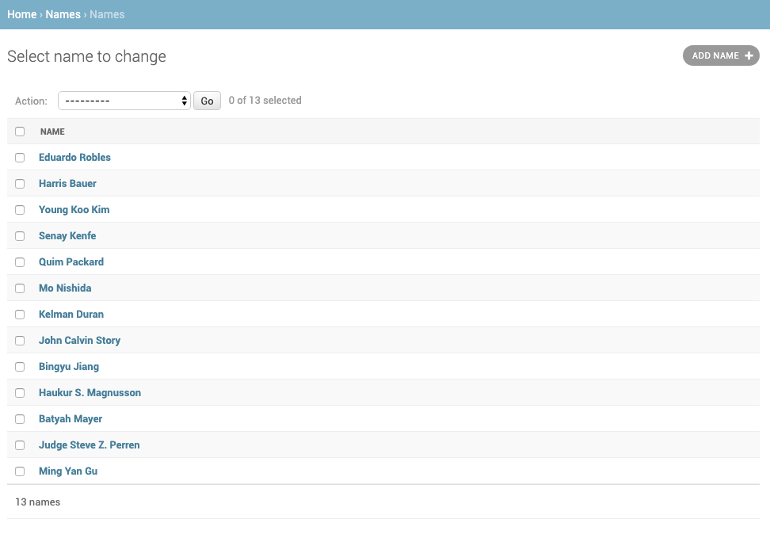
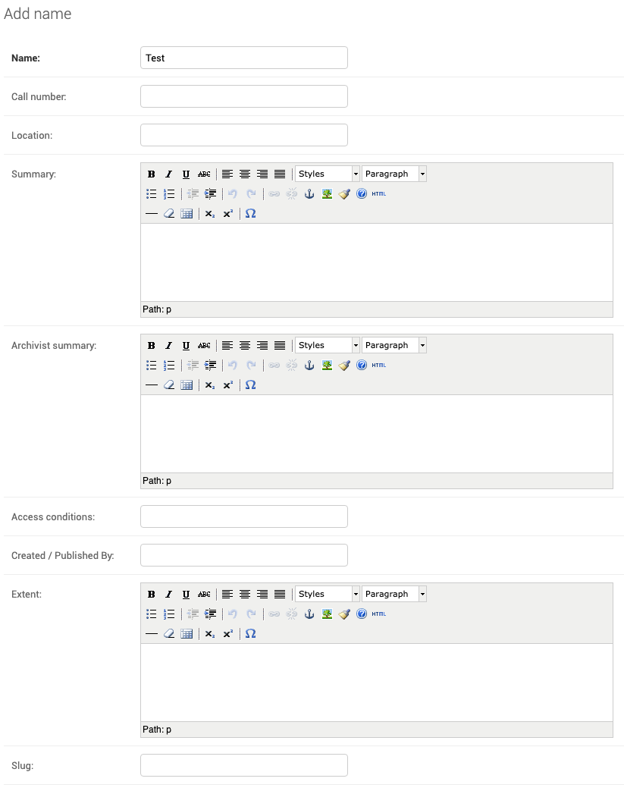
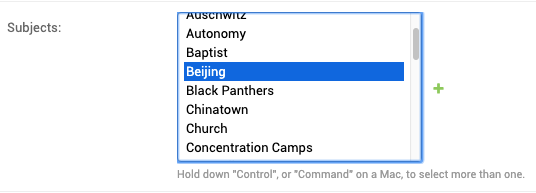
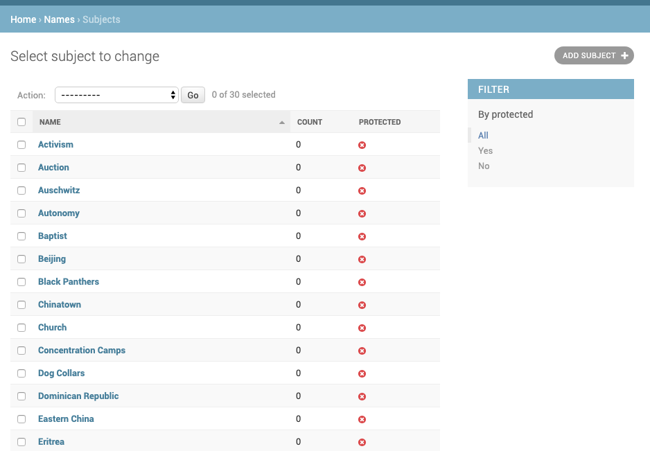
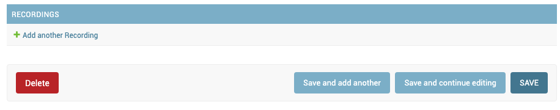
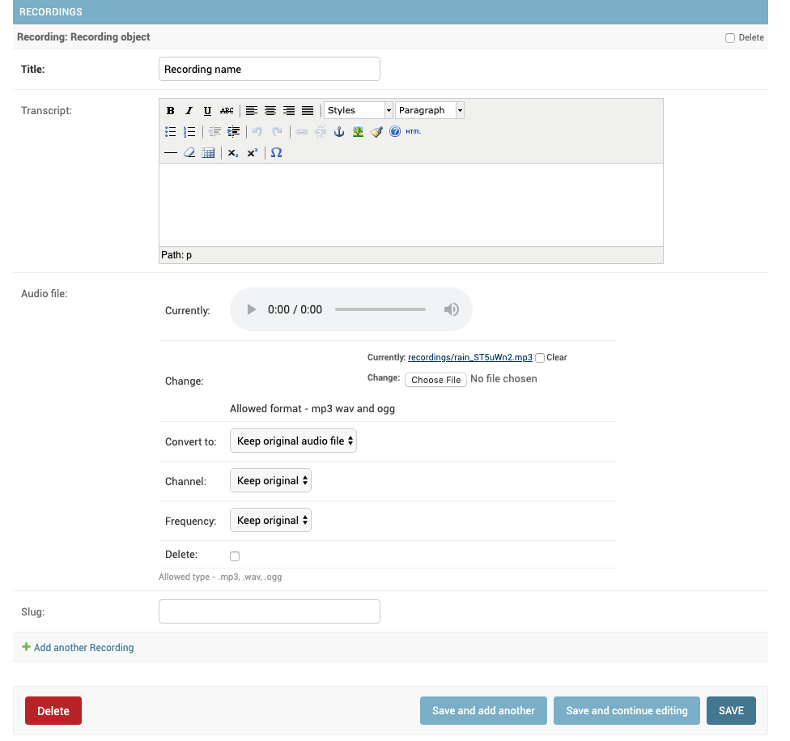
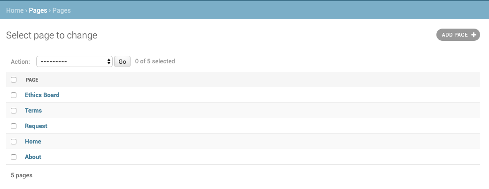
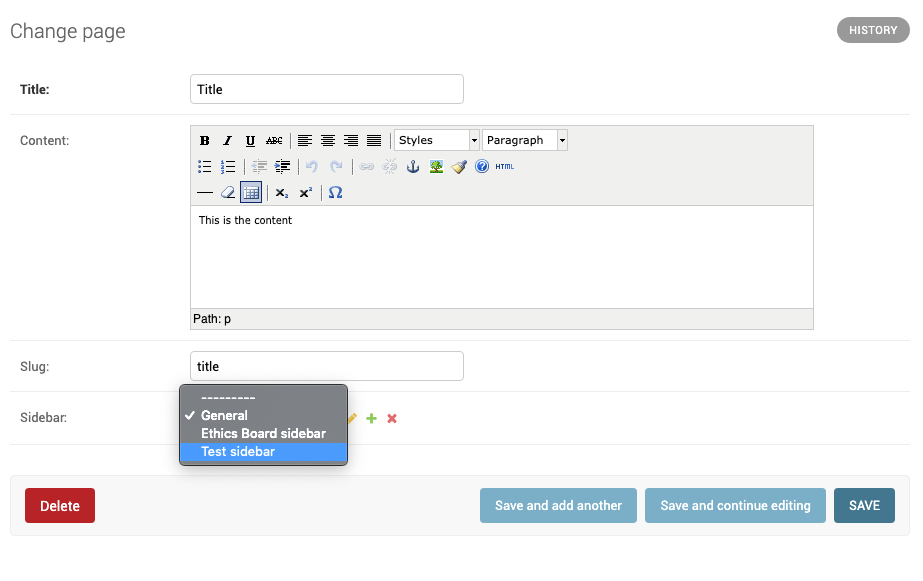

# Autonomous Oral History Group data entry and catalog maintenance

Welcome, AOHG fam!

## Adding Names and Recordings

### Names
"Names" are the core field the catalog is archived by. The names admin is [here](http://aohistorygroup.com/admin/names/name/).  

Fill out any information you have for this record: 

 - Name
 - Call number
 - Location
 - Summary
 - Archivist Summary
 - Access Conditions
 - Created / Published By
 - Extent
 - etc.

Details on slugs, keywords, recordings below.

#### A note on slugs
Don't worry about "Slug"

A "slug" should auto-populate. If you're curious about what a "slug" is, [read here](https://stackoverflow.com/questions/427102/what-is-a-slug-in-django) for an explanation. In a nutshell, it's used for URLs.

### Subjects
Subjects are used as an alternative exploration method to find "names."

You can add a subject within the [Subject](http://aohistorygroup.com/admin/names/subject/) screen, or while you're working on a [Name](http://aohistorygroup.com/admin/names/name/).

#### Subjects within Names

Within the Name view, you can select subjects to attach that name to. 

 - On a Mac: press and hold "Command," while clicking on different subjects to select multiple Subjects.
 - On Windows / Linux: press and hold "Control" instead

You can add new ones by clicking on the green plus sign.

#### Subject Admin

You can also add subjects away from names directly in the [Subject](http://aohistorygroup.com/admin/names/subject/) screen.

The process of adding a subject is similar to that of Names. To attach a subject to a name, it needs to be selected in the Name entry itself.

### Recordings

Recordings are probably best managed through the [Names](http://aohistorygroup.com/admin/names/name/) admin, since they're meant to attach to a specific Name.

Once you hit that, a new screen will pop up, where you can enter recording details and upload files. I recommend that you save the page before trying to add a sound file, especially bigger ones.

Allowed audio formats are `.wav`, `.ogg`, and `.mp3`.

## Pages

AOHG's "[Pages](http://aohistorygroup.com/admin/pages/page/)" exist alongside a "[Sidebar](http://aohistorygroup.com/admin/sidebars/sidebar/)." Isolating these two allows us to re-use sidebars between different pages.

### Creating a new page
In the [Pages](http://aohistorygroup.com/admin/pages/page/) menu "Add Page."

Give the page a title, some content and save. Slug should auto-populate.

See the note on slugs above. Now your page will be live at [aohistorygroup.com/slug-goes-here](aohistorygroup.com/slug-goes-here).

### Adding a sidebar

Within the page admin, you can either select an existing sidebar, or add a new one by clicking on the little green plus sign. 

If you want to view or edit of your sidebars, go to the [Sidebar menu](http://aohistorygroup.com/admin/sidebars/sidebar/), and hit "Add Sidebar." To add to a specific page, go back to your page, and select your sidebar from the list, as described above.

